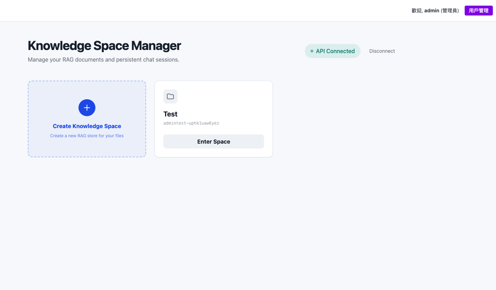
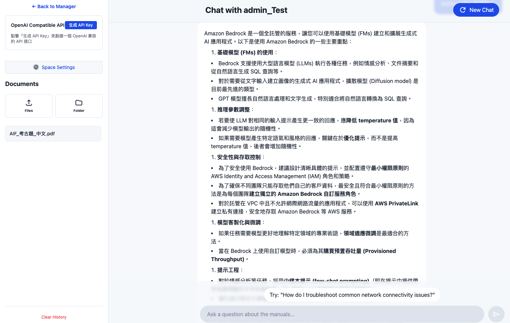
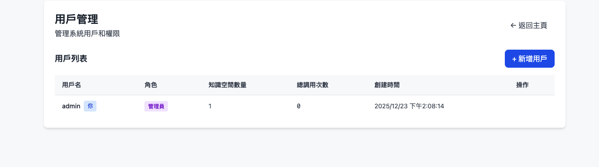

# 333 RAG 知識庫聊天系統

基於 Gemini File Search API 打造的智能知識庫管理與對話系統，支援多用戶認證、數據隔離與完整日誌追蹤。







## 功能特色

- 🗂️ **知識庫管理**：創建多個獨立的知識空間（Knowledge Space）
- 📄 **文件上傳**：支援 30+ 種文件格式（MD, PDF, DOC, TXT, 程式碼等）
- 💬 **RAG 對話**：基於文件內容的智能問答
- 🔌 **OpenAI 兼容 API**：每個知識空間可生成 OpenAI 格式的 API 接口
- 🔑 **API Key 管理**：
  - 每個用戶只能綁定一個 Gemini API Key
  - 自動為每個空間生成唯一的 API Key
  - 防止重複綁定保護機制
- 💾 **對話記錄**：自動保存每個空間的聊天歷史
- 👥 **多用戶系統**：支援用戶認證與管理員控制台
- 🔒 **數據隔離**：每個用戶只能看到和管理自己的知識空間
- 🔄 **自動同步**：以 Gemini File Search API 為真實來源，自動同步本地數據
- 📊 **完整日誌**：所有操作都有詳細的 Docker 日誌記錄

## 系統架構

### 數據同步邏輯

系統採用 **Gemini File Search API 優先** 的設計：

1. **登入時自動同步**：用戶登入後，系統會：
   - 使用用戶的 Gemini API Key 調用 File Search API
   - 獲取該 API Key 實際擁有的所有 spaces
   - 更新本地 JSON 文件（users.json, api-keys.json）
   - 清理已在 Gemini 刪除的 spaces

2. **手動輸入 API Key**：當用戶輸入新的 Gemini API Key 時：
   - 立即從 Gemini 獲取 spaces 列表
   - 同步並顯示所有 spaces
   - 檢查 API Key 是否已被其他用戶使用

3. **創建 Space**：創建新 space 時：
   - 在 Gemini 創建 RAG store
   - 自動生成 API key 並保存到 api-keys.json
   - 更新 users.json 的 spaces 列表

### 文件格式支援

系統支援以下文件格式（自動識別 MIME type）：

**文本格式**：txt, md, markdown, csv, html, xml, json  
**文檔格式**：pdf, doc, docx, xls, xlsx, ppt, pptx  
**程式碼格式**：js, ts, jsx, tsx, py, java, cpp, c, css, sql, sh  
**其他格式**：rtf, odt, zip

### 日誌系統

所有關鍵操作都會記錄到 Docker logs，方便追蹤和調試：

**登入流程** `[Auth]`
```
[Auth] Login attempt for user: username
[Auth] ✓ User logged in: username (role: user, spaces: 2)
```

**Spaces 同步** `[Sync]`
```
[Sync] Syncing spaces for user: username
[Sync] Gemini returned 2 spaces
[Sync] ✓ User username spaces updated to: space1, space2
```

**API Keys 查詢** `[Spaces]`
```
[Spaces] Fetching API keys for user: username
[Spaces] Found 2 API keys for user: username
```

**Space 配置** `[Config]`
```
[Config] Get config for space: fileSearchStores/xxx (user: username)
[Config] Config retrieved: usageCount=5, model=gemini-2.5-flash
```

**使用統計** `[Stats]`
```
[Stats] Increment usage for space: fileSearchStores/xxx (user: username)
[Stats] ✓ Usage count: 6
```

查看即時日誌：
```bash
docker logs -f rag-chat-2025
```

## 本機運行

**前置需求：** Node.js

1. 安裝依賴套件：
   ```bash
   npm install
   ```

2. 設定環境變數（複製環境變數範本）：
   ```bash
   cp .env.example .env
   ```
   
   編輯 `.env` 設定以下資訊：
   - `GEMINI_API_KEY`：你的 Gemini API Key（可在網頁界面輸入）
   - `ADMIN_USERNAME`：管理員帳號（預設：admin）
   - `ADMIN_PASSWORD`：管理員密碼（預設：admin123）

3. 啟動應用程式：
   
   **開發環境**（前端 Vite + 後端 Express，雙端口）：
   ```bash
   npm run dev
   ```
   - 前端：http://localhost:3000（自動代理 API 請求到 3002）
   - 後端：http://localhost:3002
   
   **生產環境**（單一 Express 服務器，單端口）：
   ```bash
   npm start
   ```
   - 統一端口：http://localhost:3000（前端 + API）

4. 首次登入：
   - 開啟瀏覽器訪問 `http://localhost:3000`
   - 使用管理員帳號登入（預設：admin / admin123）
   - 在管理控制台創建用戶帳號

## 用戶管理

### 管理員操作

管理員登入後可以：
1. 查看所有用戶列表
2. 創建新用戶（設定用戶名、密碼、角色）
3. 刪除用戶
4. 查看每個用戶的知識空間數量

### 普通用戶操作

普通用戶登入後可以：
1. 創建自己的知識空間
2. 上傳文件到知識空間
3. 與知識庫進行對話
4. 為每個空間生成 API Key
5. 設定自己的 Gemini API Key（會自動儲存到後端）

### Gemini API Key 管理

- **唯一綁定**：每個 Gemini API Key 只能綁定一個用戶帳號
  - 系統會自動檢查 API Key 是否已被其他用戶使用
  - 嘗試使用已綁定的 Key 會收到明確的錯誤提示

- **持久化儲存**：用戶輸入的 Gemini API Key 會同時儲存到：
  - 前端 localStorage（快速載入）
  - 後端 JSON 文件（data/users.json，持久化）
  
- **自動載入**：用戶登入時自動載入已儲存的 API Key

- **自動同步**：
  - 登入時自動從 Gemini API 獲取最新的 spaces 列表
  - 清理本地已刪除的 spaces 記錄
  - 確保數據一致性

- **數據安全**：
  - API Key 僅限用戶本人或管理員可以修改
  - Docker 部署時，掛載 `data/` 目錄確保數據持久化

### 數據隔離機制

- 每個用戶創建的知識空間會自動加上用戶名前綴（例如：`username_spacename`）
- 用戶只能看到和管理自己的知識空間
- API Key 與用戶綁定，確保數據安全

## 架構設計

### 開發環境（雙端口）
```
用戶瀏覽器
    ↓
Vite 開發服務器 (3000)
    ├── 前端頁面（熱重載）
    └── /api/* → 自動代理 → Express (3002)
```

**優點**：
- ✅ 保留 Vite 熱重載功能
- ✅ 前端請求使用相對路徑 `/api/*`
- ✅ 無需 CORS 配置

### 生產環境（單端口）
```
用戶瀏覽器
    ↓
Express (3000)
    ├── /api/* → API 邏輯
    └── /* → 靜態文件 (dist/)
```

**優點**：
- ✅ 只有一個端口 3000
- ✅ SSL 只需配置一次
- ✅ 標準的 Node.js 部署方式
- ✅ Docker 容器更簡潔

## Docker 部署

### 方式一：從 Docker Hub 拉取（最簡單，推薦）

1. 創建 `.env` 檔案並設定環境變數：
   ```bash
   cp .env.example .env
   ```
   
   編輯 `.env` 設定：
   - `GEMINI_API_KEY`：你的 Gemini API Key
   - `ADMIN_USERNAME`：管理員帳號（預設：admin）
   - `ADMIN_PASSWORD`：管理員密碼（預設：admin123）

2. **準備數據目錄（重要）**：
   ```bash
   mkdir -p data
   sudo chown -R 1001:1001 data/
   ```
   
   > **⚠️ 權限說明**：
   > - 容器以 nodejs 用戶 (UID 1001) 運行
   > - 必須設定正確權限，否則無法寫入用戶數據
   > - 如未設定會導致 API Key 消失、spaces 無法同步等問題

3. 拉取並運行容器：
   ```bash
   docker pull tbdavid2019/333ragchat:latest
   docker run -d \
     -p 3000:3000 \
     -v $(pwd)/data:/app/data \
     --env-file .env \
     --name rag-chat-2025 \
     tbdavid2019/333ragchat:latest
   ```

4. 查看日誌（即時追蹤所有操作）：
   ```bash
   docker logs -f rag-chat-2025
   ```
   
   你會看到標記清楚的日誌：
   ```
   [Auth] Login attempt for user: tatung
   [Auth] ✓ User logged in: tatung (role: user, spaces: 2)
   [Sync] Syncing spaces for user: tatung
   [Spaces] Found 2 API keys for user: tatung
   [Config] Get config for space: fileSearchStores/tatung-xxx
   [Stats] ✓ Usage count: 15
   ```

5. 停止並移除容器：
   ```bash
   docker stop rag-chat-2025
   docker rm rag-chat-2025
   ```

6. 重新啟動已存在的容器：
   ```bash
   docker start rag-chat-2025
   ```

### 方式二：使用 Docker Build（適合開發者）

1. 創建 `.env` 檔案並設定環境變數

2. **設定數據目錄權限**：
   ```bash
   mkdir -p data
   sudo chown -R 1001:1001 data/
   ```

3. 建立 Docker 映像：
   ```bash
   docker build -t rag-chat-2025:latest .
   ```

4. 運行容器：
   ```bash
   docker run -d \
     -p 3000:3000 \
     -v $(pwd)/data:/app/data \
     --env-file .env \
     --name rag-chat-2025 \
     rag-chat-2025:latest
   ```

5. 綜合指令（一鍵重建與部署）：
   ```bash
   docker stop rag-chat-2025 && \
   docker rm rag-chat-2025 && \
   docker build -t rag-chat-2025:latest . && \
   docker run -d -p 3000:3000 -v $(pwd)/data:/app/data --env-file .env --name rag-chat-2025 rag-chat-2025:latest
   ```

6. 推送到 Docker Hub：
   ```bash
   docker tag rag-chat-2025:latest tbdavid2019/333ragchat:latest
   docker push tbdavid2019/333ragchat:latest
   ```

### 訪問應用程式

無論使用哪種方式，啟動後訪問：

**開發環境**：
- **前端界面**：http://localhost:3000（Vite 自動代理 API 請求到 3002）
- **API Server**：http://localhost:3002（只提供 API）

**生產/Docker 環境**：
- **單一端口**：http://localhost:3000（包含前端 + API）
- 所有請求統一由 Express 處理，SSL 只需配置一次

### Docker 映像特點

- 🐳 **基底映像**: Node.js 20 LTS Alpine（穩定且輕量，約 180MB）
- 🔒 **安全**: 使用非 root 用戶運行
- ⚡ **優化**: Multi-stage build 減少映像大小
- 🎯 **生產就緒**: 包含 dumb-init 處理信號

## OpenAI 兼容 API 使用說明

每個知識空間都可以生成 OpenAI 兼容的 API 接口：

1. 進入任一知識空間
2. 點擊側邊欄的「生成 API Key」按鈕
3. 複製顯示的 Endpoint URL 和 API Key
4. 在任何支援 OpenAI API 的工具中使用

> **重新生成 Key (Regenerate)**：如果您需要撤銷舊的 Key，只需點擊 API Key 旁邊的「Regenerate Key」按鈕。這會立即讓舊 Key 失效並生成一個新的 Key。

### 重要概念

- **所有空間共用同一個 Endpoint**：`http://localhost:3000/v1/chat/completions`
- **每個空間有唯一的 API Key**：`grag-xxxxxxxx-xxxx-xxxx-xxxx-xxxxxxxxxxxx`
- **Server 會根據 API Key 自動識別並使用對應空間的文件庫**
- **生產環境單一端口**：SSL 證書只需配置一次

## OpenAI Compatible API

每個知識空間都可以生成一個 OpenAI 兼容的 API 接口：

1. 進入某個 Space
2. 點擊側邊欄的「生成 API Key」按鈕
3. 複製 endpoint URL 和 API key
4. 使用於任何支援 OpenAI 的工具

> **重新生成密鑰**：如果你需要撤銷舊密鑰，請點擊 API Key 旁邊的「Regenerate Key」按鈕。這將立即使舊密鑰失效並生成新密鑰。

### 關鍵概念

- **所有空間共享同一個 Endpoint**：`http://localhost:3000/v1/chat/completions`
- **每個空間擁有唯一的 API Key**：`grag-xxxxxxxx-xxxx-xxxx-xxxx-xxxxxxxxxxxx`
- **服務器根據 API Key 自動識別並使用對應空間的文檔庫**
- **生產環境單端口架構**：SSL 證書只需配置一次

### 使用範例

```bash
curl -X POST http://localhost:3000/v1/chat/completions \
  -H "Authorization: Bearer YOUR_API_KEY" \
  -H "Content-Type: application/json" \
  -d '{
    "model": "gemini-2.5-flash",
    "messages": [
      {"role": "user", "content": "你的問題"}
    ]
  }'
```

### 兼容工具

此 API 可用於任何支援 OpenAI API 的工具：
- Cursor AI
- Continue.dev
- LibreChat
- 其他支援自定義 OpenAI endpoint 的應用

## 疑難排解

### 常見問題

**Q: Docker 容器重啟後 API Key 消失了？**

A: 這是權限問題，請確保：
```bash
sudo chown -R 1001:1001 data/
```

**Q: 看不到自己的 knowledge spaces？**

A: 系統會在登入時自動同步，如果仍看不到：
1. 檢查 Docker logs：`docker logs -f rag-chat-2025`
2. 確認 Gemini API Key 正確
3. 查看 `[Sync]` 日誌是否有錯誤

**Q: 上傳文件出現 MIME type 錯誤？**

A: 系統已支援 30+ 種文件格式，如果仍出現問題：
- 確認文件副檔名正確（如 `.md`, `.pdf`, `.txt`）
- 查看 Docker logs 中的錯誤訊息

**Q: 無法查詢文件內容？**

A: 確認：
1. 文件已成功上傳（檢查 Space 的文件列表）
2. Gemini API Key 有效
3. 查看 Docker logs 中的 `[Query]` 日誌

**Q: URL 中的空間名稱有特殊字符導致 404？**

A: 系統已自動處理 URL 編碼，如果仍有問題，避免在 space 名稱中使用 `/` 等特殊字符

### 日誌追蹤

查看即時日誌以了解系統運作：
```bash
docker logs -f rag-chat-2025
```

關鍵日誌標記：
- `[Auth]` - 用戶登入/認證
- `[Sync]` - Spaces 同步操作
- `[Spaces]` - API Keys 查詢
- `[Config]` - Space 配置讀取
- `[Stats]` - 使用統計更新
- `[Query]` - 文件查詢操作

---

# Run and deploy your AI Studio app

This contains everything you need to run your app locally.

View your app in AI Studio: https://ai.studio/apps/drive/1Wfv9mVFth8vC4qF2aXcYPSp6y-jp240-

## Run Locally

**Prerequisites:**  Node.js

1. Install dependencies:
   ```bash
   npm install
   ```

2. Set the `GEMINI_API_KEY` in `.env` (copy from `.env.example`), or set it in the UI:
   ```bash
   cp .env.example .env
   # Edit .env and add your GEMINI_API_KEY
   ```

3. Run the app:
   
   **Development** (Vite + Express, dual ports):
   ```bash
   npm run dev
   ```
   - Frontend: http://localhost:3000 (auto-proxies API to 3002)
   - Backend: http://localhost:3002
   
   **Production** (Single Express server, single port):
   ```bash
   npm start
   ```
   - Unified port: http://localhost:3000 (Frontend + API)

## Docker Deployment

### Method 1: Pull from Docker Hub (Easiest, Recommended)

1. Create `.env` file and set your API key:
   ```bash
   cp .env.example .env
   # Edit .env and add your GEMINI_API_KEY, ADMIN_USERNAME, ADMIN_PASSWORD
   ```

2. Prepare data directory (Important):
   ```bash
   mkdir -p data
   sudo chown -R 1001:1001 data/
   ```

3. Pull and run container:
   ```bash
   docker pull tbdavid2019/333ragchat:latest
   docker run -d \
     -p 3000:3000 \
     -v $(pwd)/data:/app/data \
     --env-file .env \
     --name rag-chat-2025 \
     tbdavid2019/333ragchat:latest
   ```

4. View logs:
   ```bash
   docker logs -f rag-chat-2025
   ```

5. Stop and remove container:
   ```bash
   docker stop rag-chat-2025
   docker rm rag-chat-2025
   ```

6. Restart existing container:
   ```bash
   docker start rag-chat-2025
   ```

### Method 2: Using Docker Build (For Developers)

1. Create `.env` file and set your API key:
   ```bash
   cp .env.example .env
   # Edit .env and add your GEMINI_API_KEY
   ```

2. Build Docker image:
   ```bash
   docker build -t rag-chat-2025:latest .
   ```

3. Run container:
   ```bash
   docker run -d \
     -p 3000:3000 \
     -v $(pwd)/data:/app/data \
     --env-file .env \
     --name rag-chat-2025 \
     rag-chat-2025:latest
   ```
   
   **Note**:
   - Docker uses production mode, **only port 3000 needed** (Frontend + API)
   - Use `-v $(pwd)/data:/app/data` to mount data directory for persistence

    > **Important: Directory Permissions**
    > Since the container runs as a non-root user (UID 1001), you must ensure the host directory exists and has correct permissions:
    > ```bash
    > mkdir -p data
    > sudo chown -R 1001:1001 data/
    > ```
    > If you skip this, the container effectively cannot write to the mapped volume, causing data loss on restart (e.g., API keys disappearing).

321a. **Run container (with permissions set):**
   ```bash
   docker run -d \
     -p 3000:3000 \
     -v $(pwd)/data:/app/data \
     --env-file .env \
     --name rag-chat-2025 \
     rag-chat-2025:latest
   ```

322: 4. View logs:
   ```bash
   docker logs -f rag-chat-2025
   ```

5. Stop and remove container:
   ```bash
   docker stop rag-chat-2025
   docker rm rag-chat-2025
   ```

6. Restart existing container:
   ```bash
   docker start rag-chat-2025
   ```

### Method 2: Using Docker Compose (Quick start)

1. Make sure Docker and Docker Compose are installed

2. Create `.env` file and set your API key:
   ```bash
   cp .env.example .env
   # Edit .env and add your GEMINI_API_KEY
   ```

3. Start containers:
   ```bash
   docker-compose up -d
   ```

4. Stop containers:
   ```bash
   docker-compose down
   ```

### Access Application

After starting with either method:

**Development Environment**:
- **Frontend**: http://localhost:3000 (Vite auto-proxies API requests to 3002)
- **API Server**: http://localhost:3002 (API only)

**Production/Docker Environment**:
- **Single Port**: http://localhost:3000 (Frontend + API)
- All requests handled by Express, SSL only needs one configuration

### Docker Image Features

- 🐳 **Base Image**: Node.js 20 LTS Alpine (stable and lightweight, ~180MB)
- 🔒 **Security**: Runs as non-root user
- ⚡ **Optimized**: Multi-stage build for smaller image size
- 🎯 **Production Ready**: Includes dumb-init for proper signal handling

## OpenAI Compatible API

Each Knowledge Space can generate an OpenAI-compatible API endpoint:

1. Enter a Space
2. Click "生成 API Key" in the sidebar
3. Copy the endpoint URL and API key
4. Use it with any OpenAI-compatible tool

> **Regenerate Key**: If you need to revoke an old key, click the "Regenerate Key" button next to your API Key. This will invalidate the old key immediately and generate a new one.

### Key Concept

- **All spaces share the same Endpoint**: `http://localhost:3000/v1/chat/completions`
- **Each space has a unique API Key**: `grag-xxxxxxxx-xxxx-xxxx-xxxx-xxxxxxxxxxxx`
- **Server automatically identifies and uses the corresponding space's document library based on the API Key**
- **Production single-port architecture**: SSL certificate only needs one configuration

Example usage:
```bash
curl -X POST http://localhost:3000/v1/chat/completions \
  -H "Authorization: Bearer YOUR_API_KEY" \
  -H "Content-Type: application/json" \
  -d '{
    "model": "gemini-2.5-flash",
    "messages": [
      {"role": "user", "content": "Your question"}
    ]
  }'
```
